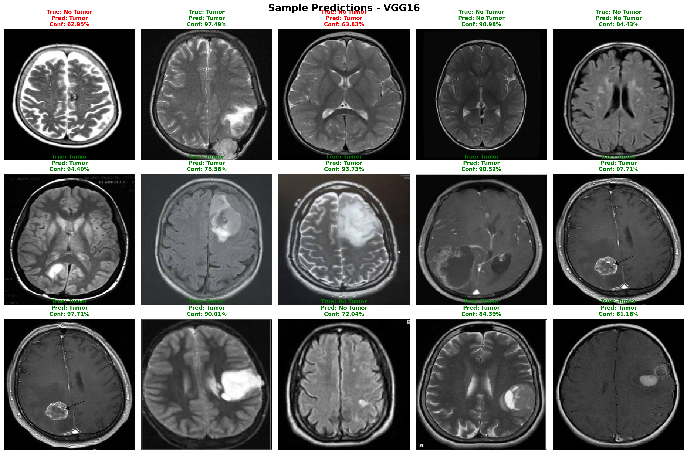
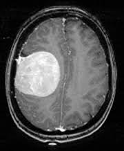
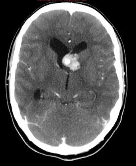
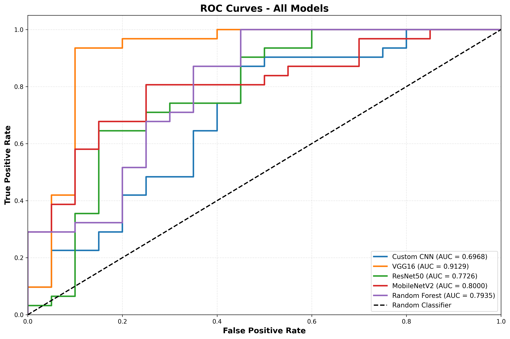

# Brain Tumor Detection System



## Overview

This web application uses deep learning models to detect brain tumors from MRI images. The system provides a user-friendly interface for uploading MRI scans and receiving instant predictions with confidence scores and visualizations.

## Features

- **Multiple AI Models**: Choose from VGG16, ResNet50, MobileNetV2, and custom CNN models
- **High Accuracy**: Up to 84% accuracy with the VGG16 transfer learning model
- **Interactive UI**: Modern, responsive interface with intuitive controls
- **Instant Results**: Fast predictions with confidence scores
- **Detailed Visualizations**: Performance metrics and model comparisons
- **Secure Processing**: Images are processed securely and not stored permanently

## Models

| Model | Description | Accuracy |
|-------|-------------|----------|
| VGG16 | Deep convolutional network with transfer learning | 84.31% |
| ResNet50 | Residual network with 50 layers | 78.43% |
| MobileNetV2 | Lightweight efficient neural network | 80.39% |
| Custom CNN | Custom built convolutional neural network | 66.67% |

## Dataset

The models were trained on a dataset of brain MRI images with two classes:
- **Yes**: Images with brain tumors
- **No**: Images without brain tumors

## Screenshots

### Home Page


### Prediction Page


### Visualization Page


## Installation

1. Clone the repository:
```bash
Extract the provided zip file or clone the repository:
cd brain-tumor-detection
```

because of the large file we are not able to upload the models folder in the repository. Please download the models folder from the following link:
[Download Models](https://drive.google.com/file/d/1rSMHBdHM0pLIrQiOvGFJ9wRISCleqyQv/view?usp=sharing)

After downloading, extract the models folder and place it in the root directory of the project.

2. Install dependencies:
```bash
pip install -r requirements.txt
```
~
3. Run the application:
```bash
python app.py
```

4. Access the application at: http://localhost:5000

## Usage

1. Navigate to the "Predict" page
2. Upload a brain MRI image (JPG, JPEG, or PNG format)
3. Select an AI model (VGG16 recommended for best accuracy)
4. Click "Analyze" to get the prediction result
5. View the prediction with confidence score and visualization

## Technical Details

- **Backend**: Flask (Python)
- **Frontend**: HTML, CSS, JavaScript, Bootstrap
- **Deep Learning**: TensorFlow, Keras
- **Data Visualization**: Chart.js, Matplotlib

## Model Training

The models were trained using the following approach:
- Data split: 64% training, 16% validation, 20% testing
- Data augmentation: Rotation, zoom, flip, shift
- Transfer learning: Pre-trained weights from ImageNet
- Fine-tuning: Custom top layers for binary classification

## Performance Metrics

The models were evaluated using:
- Accuracy
- Precision
- Recall
- F1-Score
- ROC Curves

## Future Improvements

- Integration with DICOM medical imaging format
- 3D MRI scan support
- Segmentation of tumor regions
- Deployment as a mobile application
- Integration with hospital systems

## License

This project is licensed under the MIT License - see the LICENSE file for details.

## Acknowledgments

- Dataset provided by Kaggle
- Inspired by research in medical image analysis
- Special thanks to the open-source community for tools and libraries

## Contact

For questions or feedback, please contact:
- Email: abhinandanvyas7811@gmail.com
